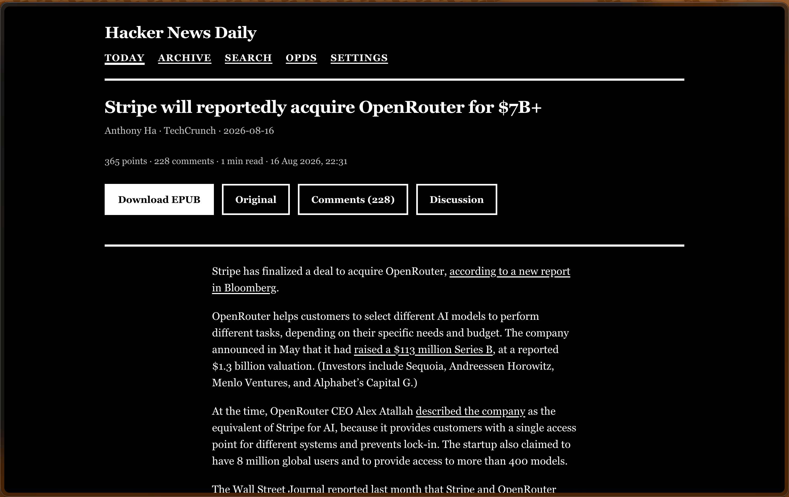
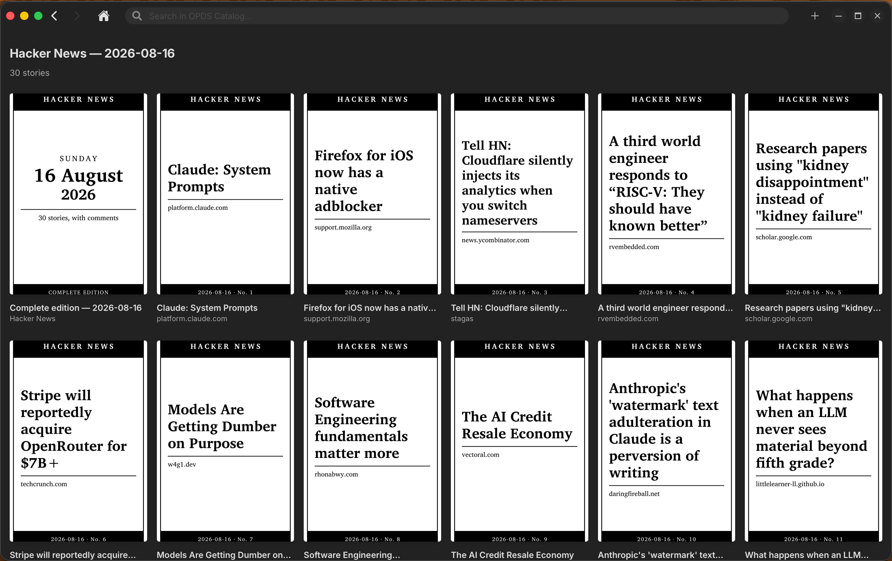
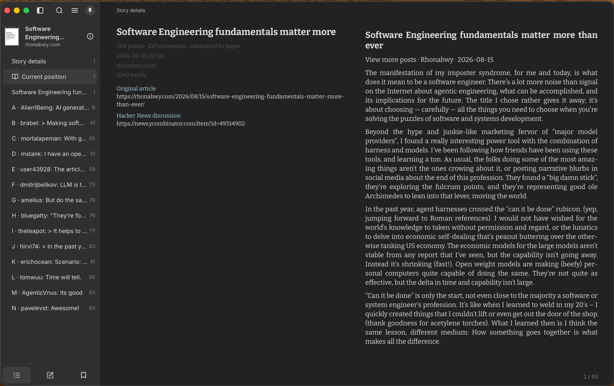
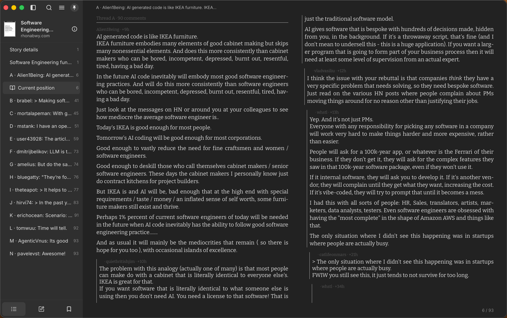
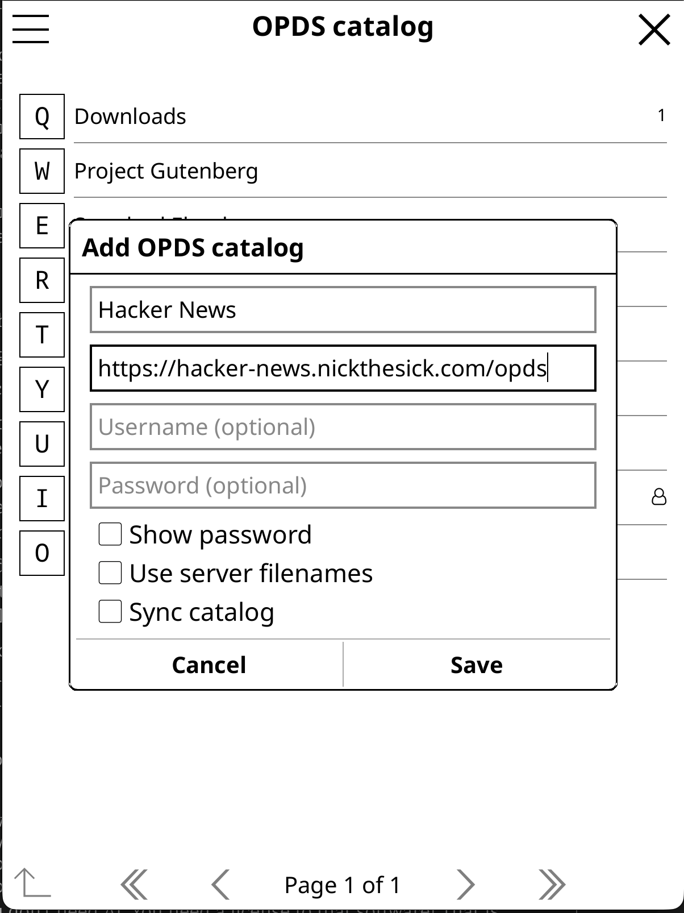
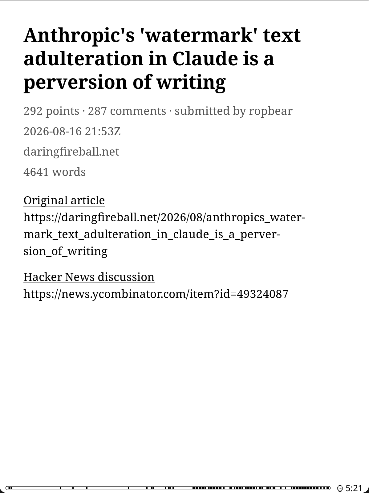

# hacker-opds

The top 30 Hacker News stories of each day, turned into EPUBs and served over
OPDS, RSS and the web — for reading on an e-ink device instead of a phone.

Each story becomes a book containing the extracted article text and the entire
comment tree. Each day becomes a digest containing all thirty. Point KOReader,
Kobo, Boox or Calibre at the OPDS catalogue and the day's reading is already
waiting on the device.



## Why

Hacker News is a good reading list and a bad reading surface. The article is on
someone else's site behind their layout, the discussion is somewhere else again,
and both are on a backlit screen that is very good at interrupting you.

This takes the same content and makes it finishable: article and comments in one
file, on a device with no notifications, that you can read outside.

## What it does

- **Selects** the top 30 stories posted in a calendar day, ranked by points,
  using the Algolia HN search API.
- **Extracts** the article with [defuddle](https://github.com/kepano/defuddle),
  embedding images (resized, re-encoded, cached across builds).
- **Fetches the comment tree** by parsing Hacker News' own item page — one
  request per story, complete coverage including collapsed subtrees, in exact
  display order.
- **Builds an EPUB** per story and one digest per day, byte-deterministically,
  so the SHA-256 can be served as a strong ETag with `immutable`.
- **Publishes** the result as an OPDS 1.2 catalogue, RSS feeds with full article
  bodies, and a website designed for e-ink.

Editions are immutable once built and kept for 90 days.

## Screenshots

### The catalogue

Every book gets a generated cover: the headline set as large as it fits, the
source domain, and a band carrying the date and the story's rank that day. They
are pure black and white with no greys used as design elements, so the
silhouette still reads in a 120-pixel grid cell on a greyscale panel.

The first tile is the day's complete edition — all thirty stories in one file.



### Inside a book

Front matter carries the score, the submitter, the source and the word count,
with the original article and the Hacker News thread linked and their URLs
printed underneath — a book read offline should still tell you where it came
from.

The table of contents lists the article, then every comment thread lettered from
A, each labelled with its opening author, a snippet and how many replies it
holds, so you can pick a thread without reading into it.



The discussion follows the article in the same file. Depth is marked in each
comment header, the submitter is highlighted wherever they reply, ages are
relative to the story's own post time rather than to now, and Hacker News'
`>` quoting convention is rendered as an actual quote.



### On the device

Point KOReader at `/opds` once and the catalogue is there permanently.




Covers are generated at 1000×1600 — the aspect Kindle and Kobo expect — so a
downloaded book looks like a book on the shelf rather than a grey placeholder.




### On the web

The website is server-rendered HTML that works with **no JavaScript and no CSS**.
Comment threads collapse through native `<details>`, with sticky headers that
stack by depth so the ancestry of whatever you are reading stays on screen and
any level can be collapsed from where you are. Reading font and light/dark theme
are stored in a cookie and switched by plain links, so the first byte already
carries the right theme — no flash, which on e-ink is a full panel refresh.

## Running it

### Docker

```bash
docker run -d \
  --name hacker-opds \
  -p 8080:3000 \
  -v hacker-opds-data:/data \
  -e EDITION_TZ=Europe/Amsterdam \
  ghcr.io/nperez0111/hacker-opds:main
```

Or with the provided compose file:

```bash
docker compose up -d
```

The image is ~117 MB, of which 83 MB is the Bun binary. It runs as a non-root
user, stores everything under `/data`, and ships a healthcheck that reads
`/healthz` rather than trusting the status code (the endpoint answers 200 even
when degraded, by design).

Multi-arch images (`linux/amd64`, `linux/arm64`) are published to GHCR on every
push to `main`, signed with cosign and carrying build provenance attestations.

### From source

Requires [Bun](https://bun.sh) 1.3.14 (see `.bun-version`).

```bash
bun install
bun run dev          # http://localhost:3000
```

Nothing appears until an edition is ingested. Editions close six hours after the
day ends, so start with yesterday:

```bash
bun run ingest                 # yesterday, in the configured timezone
bun run ingest 2026-08-16      # a specific day
bun run ingest 2026-08-16 --build   # ingest, then build every EPUB and the digest
```

Without `--build` the hourly prewarm task picks the edition up — it sweeps up to
30 unbuilt stories per run, so a few days of backfill clear over a morning — or
you can just request a book and it will build on demand. `--build` only writes the day's
digest if every story succeeded — a digest with a hole in it would otherwise be
cached and served as though it were complete.

For production:

```bash
bun run build
bun run start
```

## Endpoints

### Website

| Path | |
|---|---|
| `/` | The most recent edition |
| `/archive` | Every edition still in retention |
| `/archive/{date}` | One edition |
| `/story/{id}` | Article and full comment tree |
| `/search?q=` | Full-text search over titles and article bodies |
| `/settings` | Reading font and theme |
| `/offline` | Service worker fallback |

### Catalogue and feeds

| Path | |
|---|---|
| `/opds` | OPDS 1.2 root (navigation) |
| `/opds/today` | The latest edition |
| `/opds/archive`, `/opds/archive/{date}` | Past editions |
| `/opds/search?q=`, `/opds/opensearch.xml` | OpenSearch |
| `/rss` | The 50 newest stories, full article bodies, EPUB enclosures |
| `/rss/archive/{date}` | One edition as RSS |

### Files

| Path | |
|---|---|
| `/epub/story/{id}.epub` | One story |
| `/epub/edition/{date}.epub` | The whole day |
| `/cover/story/{id}.png`, `/cover/edition/{date}.png` | Generated covers |
| `/healthz` | JSON health report |
| `/robots.txt` | Disallows everything — see below |

## Configuration

Environment variables have no prefix. `src/defaults.ts` is the single source of
truth; everything below can be overridden.

### Editions

| Variable | Default | |
|---|---|---|
| `EDITION_TZ` | `Europe/Amsterdam` | The zone a "day" is measured in |
| `EDITION_LAG_HOURS` | `6` | How long after midnight an edition closes |
| `EDITION_STORY_LIMIT` | `30` | Stories per edition |
| `RETENTION_DAYS` | `90` | How long editions are kept |

### Output

| Variable | Default | |
|---|---|---|
| `PUBLIC_BASE_URL` | *(derived from the request)* | Set only if the derived origin is wrong |
| `DATA_DIR` | `./.data` | SQLite database and blobs |
| `RSS_ITEM_LIMIT` | `50` | Stories in the site-wide feed |
| `SEARCH_RESULT_LIMIT` | `25` | Results per page |
| `COMMENT_INDENT_MAX_DEPTH` | `5` | Indent cap; deeper comments flush left |
| `DIGEST_THREADS_PER_STORY` | `20` | Threads per story in the daily digest |
| `DIGEST_COMMENT_MAX_DEPTH` | `4` | Comment depth cap in the digest |

`PUBLIC_BASE_URL` is worth understanding: OPDS feeds carry absolute URLs, so a
catalogue that advertises `localhost` loads fine on the e-reader and then fails
on every download. By default the origin is taken from the request, which is
always reachable by definition. Set this only when a proxy hides the real one.

### Images

| Variable | Default | |
|---|---|---|
| `IMAGE_MAX_WIDTH` | `800` | Downscale target |
| `IMAGE_QUALITY` | `72` | JPEG quality |
| `MAX_EPUB_IMAGE_BYTES` | `4194304` | Skip images larger than this |

### Politeness

| Variable | Default | |
|---|---|---|
| `FETCH_CONCURRENCY` | `4` | Parallel article fetches |
| `FETCH_TIMEOUT_MS` | `20000` | |
| `PER_DOMAIN_DELAY_MS` | `1000` | Gap between hits on one domain |
| `HN_REQUEST_DELAY_MS` | `2000` | Gap between HN item pages (serialised) |
| `HN_MAX_WAIT_MS` | `1800000` | How long a background build waits out a throttle |
| `HN_ON_DEMAND_WAIT_MS` | `20000` | The same, when a reader is waiting |
| `MAX_FETCH_BYTES` | `5242880` | |
| `RESPECT_ROBOTS` | `false` | See below |
| `USER_AGENT_CONTACT` | *(empty)* | Contact URL or email in the User-Agent |

Set `USER_AGENT_CONTACT` if you run this anywhere public. It costs nothing and
it is the difference between a site owner emailing you and blocking you.

### Runtime

| Variable | Default | |
|---|---|---|
| `PORT` | `3000` | |
| `TZ` | *(system)* | Cron schedules use process local time |
| `LOG_LEVEL` | `info` | pino level |
| `LOG_PRETTY` | `false` | NDJSON off, human-readable on |
| `GIT_SHA` | *(empty)* | Surfaced by `/healthz` |

## Scripts

```
bun run dev          # dev server, pretty logs, debug level
bun run build        # production bundle into .output/
bun run start        # run the built server
bun test             # ~1080 tests, no network, no fixtures to record
bun run typecheck    # tsc --noEmit
bun run probe        # crawl the OPDS catalogue and validate it end to end
bun run ingest       # ingest an edition
bun run reindex      # rebuild the search index
bun run reset        # inspect or delete derived data
bun run health       # curl /healthz
bun run fonts:build  # regenerate the subsetted web fonts
```

`reset` reports by default and only deletes when told to:

```bash
bun run reset                      # what is there
bun run reset --epubs              # drop built books, keep content
bun run reset --all --dry-run
```

`probe` is the one to reach for when something looks wrong. It walks the whole
catalogue, follows every link, downloads sample EPUBs and checks their magic
bytes and ETag revalidation:

```bash
bun run probe http://localhost:3000 --deep
```

### In a container

The image carries `.output` and nothing else — no source tree, no
`node_modules` — so `bun run ingest` has nothing to run there. `bun run build`
bundles the three maintenance scripts into the output instead, and they are
exec'd by path with exactly the arguments documented above:

```bash
docker exec hacker-opds bun run /app/.output/server/scripts/ingest.mjs 2026-08-16
docker exec hacker-opds bun run /app/.output/server/scripts/ingest.mjs 2026-08-16 --build
docker exec hacker-opds bun run /app/.output/server/scripts/reindex.mjs --all
docker exec hacker-opds bun run /app/.output/server/scripts/reset.mjs --epubs --date 2026-08-16 --dry-run
```

`docker exec` inherits the image's `USER`, so these already run as `bun` and
write to `/data` exactly as the server does — `-u` is not needed, and `-u root`
would leave root-owned files behind for the server to trip over. They read the
container's environment too, so `DATA_DIR`, `EDITION_TZ` and the rest mean the
same thing to a script as they do to the server.

`probe` is deliberately not shipped. Its headline check is that no catalogue
link leaves the crawl origin, so aimed at `127.0.0.1` from inside the container
it would flag every correctly-formed link on any deployment that sets
`PUBLIC_BASE_URL`. It is a tool to point *at* a deployment, not to run in one.

Doing this while the server is up is safe, with one exception. SQLite is in WAL
mode and writers wait for each other rather than failing, so an exec'd script
and the hourly prewarm can overlap freely. The coalescer that collapses
duplicate builds is per-process, so two processes can build the same book at
once — but EPUB bytes are deterministic, so that costs work rather than
correctness. The exception is two ingests of the **same** edition at the same
time: artifacts are written straight to their final path rather than through a
rename, and an ingest refreshes points and comment counts, so the two runs can
compute genuinely different bytes for one file and interleave them.

Prefer `ingest <date>` on its own. Plain ingest is one Algolia request and
touches HN not at all; `--build` fetches comment trees, and `HN_REQUEST_DELAY_MS`
is enforced *within* a process — a second one shares neither the queue nor the
cool-off that a 403 sets, so it doubles the request rate against HN and keeps
knocking while the first process is politely waiting. Ingest the day and let
prewarm build it, or run `--build` knowing the server is idle.

If HN does start refusing, you will see it: the throttle logs at `warn`, and a
run parks as soon as the first build is deferred rather than spending the full
`HN_MAX_WAIT_MS` budget on each remaining story in turn.

## Design notes

A few decisions that are not obvious from the code, and that you would otherwise
have to rediscover.

**Comments come from HN's HTML, not its API.** Algolia's `/items/:id` omits every
subtree under a dead or deleted parent — 24 of 53 comments on one story. Algolia
comment *search* has no ranking field, so sibling order can only be
chronological, which came out ~50% inverted against HN's real order. The
Firebase API is correct but has no bulk endpoint: 810 requests for a
760-comment thread. Parsing the item page gives complete coverage, exact
ordering, and one request.

**Rate limits are waited out, never routed around.** HN throttles item pages
aggressively and its 403 is a soft throttle page whose body is literally
`Sorry.`. Requests are serialised behind a single slot, and a throttle parks the
whole queue rather than letting thirty stories each rediscover it. Books are
built ahead of demand precisely because nothing needs them at a particular
moment, so waiting costs only time.

**EPUB output is byte-deterministic.** The clock is pinned to the story's own
submission time and every zip entry gets a fixed timestamp, so rebuilding
identical input produces identical bytes. That is what allows the SHA-256 to be
served as a strong ETag with a one-year `immutable` cache policy.

**The website works with no JavaScript and no CSS.** Comment collapsing is native
`<details>`. The theme and font switcher are plain links that set a cookie
server-side — a client-side toggle would need scripting and would cause a full
white-to-black panel flash on e-ink. The service worker, the scroll-position
correction and the "save edition offline" button are all additive: turn scripting
off and you lose caching, not access.

**`robots.txt` disallows everything.** This republishes other people's writing
for one reader on one device. Letting it be crawled into a search index or a
training corpus is a different thing. `noindex` ships three ways — robots.txt,
a meta tag, and an `X-Robots-Tag` header on every response, including the EPUBs,
which have no head to put a meta tag in.

**`RESPECT_ROBOTS` is off by default.** Article fetches happen because a reader
asked for a specific link they already saw on HN, which is user-agent behaviour
rather than crawling; this system discovers nothing on its own. The caveat is
real though: the prewarm task fetches a whole edition before anyone asks, which
*is* closer to crawling. The controls that actually protect sites — identifying
user agent, per-domain delay, concurrency cap, timeouts, size cap — stay on
either way.

## Stack

Bun · [Nitro](https://nitro.build) 3 · [h3](https://h3.dev) v2 ·
[mono-jsx](https://github.com/ije/mono-jsx) · `bun:sqlite` ·
[defuddle](https://github.com/kepano/defuddle) · linkedom · JSZip ·
[@resvg/resvg-js](https://github.com/yisibl/resvg-js) · luxon · pino

Fonts are [Charis SIL](https://software.sil.org/charis/),
[Literata](https://github.com/googlefonts/literata) and
[Atkinson Hyperlegible](https://www.brailleinstitute.org/freefont), all under
the SIL Open Font License — subsetted and self-hosted. See
`src/web/fonts/NOTICE.md`.

## License

[MIT](LICENSE).

The code is mine to license. The articles and comments it renders are not — they
belong to the people who wrote them, and this only reformats them for a device
that cannot read the web comfortably.
